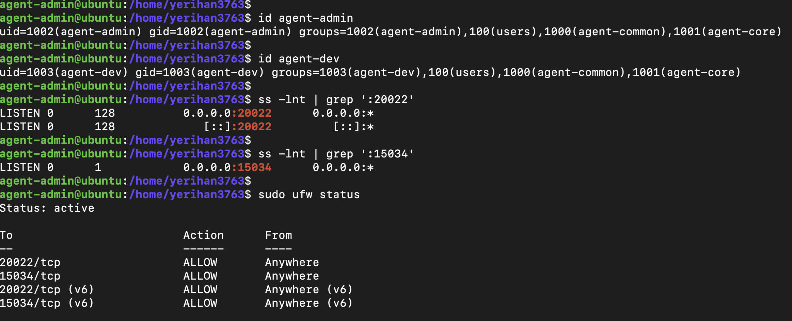
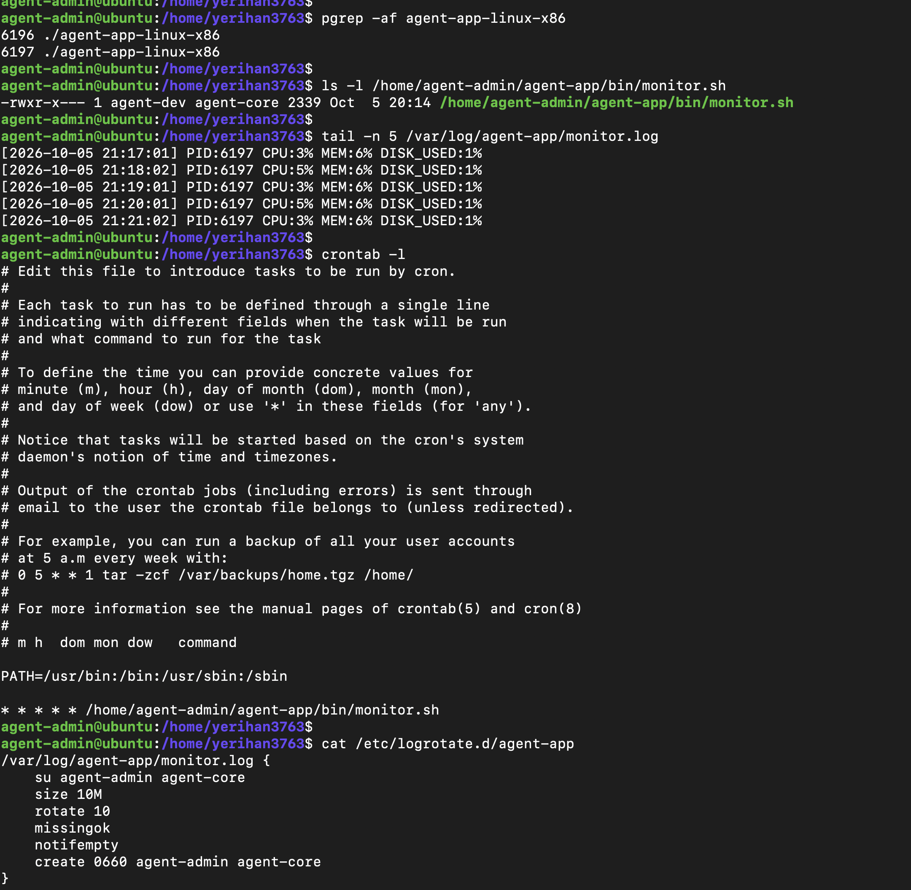

# B4-1 미션
## 목적
애플리케이션 서버 운영 환경 모의 구축

## 목표 학습
- 사용자/그룹/디렉토리 권한 관리
- 네트워크 보안 (Firewall, Port 변경, Root 권한 금지)
- 어플리케이션 모니터링 스크립트 주기적 자동 실행
- 로그 자동화 (조건: 파일 크기, 화일 개수) 

# 미션 수행 결과 요약
## 애플리케이션(agent-app) 동작 환경
- 사용자: agent-admin, agent-dev, agent-test
- 그룹: agent-common, agent-core
- SSH가 LISTEN 중인 포트: 20022
- 애플리케이션이 LISTEN 중인 포트: 15034
- UFW 설정 상태, 활성 상태

## 애플리케이션(agent-app) 동작
- 프로세스 ID (parent, child)
- monitor.sh
- monitor.sh의 로그 생성 여부
- crontab 등록 상황
- logrotate 등록 상황

# 산출물
## 요구사항 수행 내역서 
[요구사항_수행_내역서.md](./요구사항_수행_내역서.md) 

## 모니터링 스크립트
[monitor.sh](./monitor.sh)

## 환경구축 가이드 
[환경구축_가이드.md](./환경구축_가이드.md)
